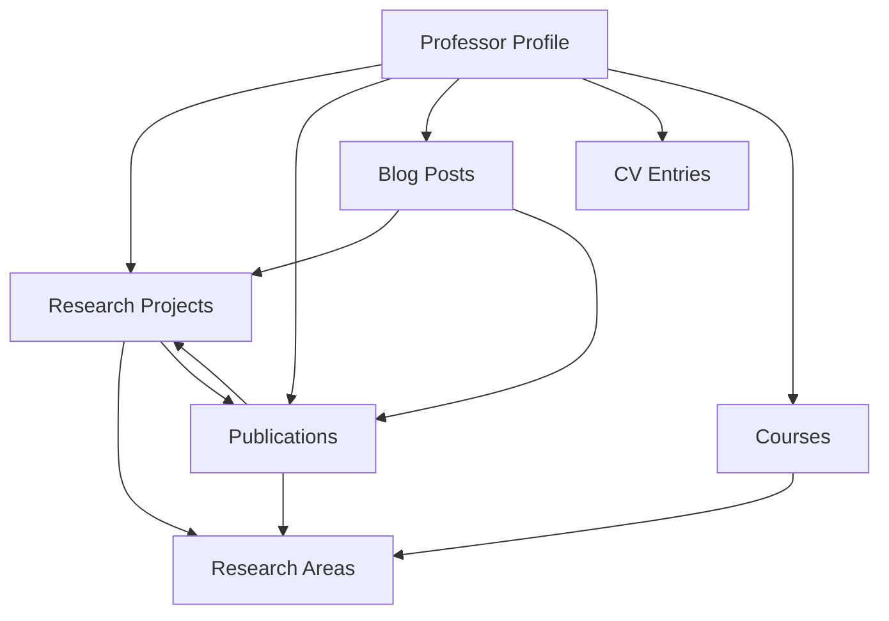

# Math Professor Portfolio - Sanity CMS Schema

A comprehensive, elegant content management system for a mathematics professor's academic portfolio, built with **Sanity Studio v4**, **TypeScript**, and **functional programming** principles.

## 🎯 Overview

This schema system provides a complete content model for:
- **Academic Profile** - Personal information, biography, and credentials
- **Research Management** - Projects, publications, and areas of expertise  
- **Teaching Portfolio** - Courses, CV entries, and academic achievements
- **Academic Blog** - Rich content with mathematical expressions and code blocks
- **Taxonomy System** - Research areas and categorization

## 📋 Schema Types

### Core Documents

#### 1. **Professor Profile** (`professorType`) - SINGLETON
**Icon:** 👤 UserIcon  
**Purpose:** Single professor profile document with fixed ID `professor-profile`

**Singleton Features:**
- Only one document can exist
- Automatically created with consistent ID
- Direct navigation in Studio (no list view)
- Always accessible via `*[_type == "professor"][0]` query

**Field Groups:**
- **Personal Information** (default)
  - Full name, display name, academic titles
  - Profile image with alt text
  - Short bio (300 chars) and full biography (rich text)
  
- **Academic Information**  
  - Current position, department, institution
  - Primary research areas (references)
  - CV file upload

- **Contact Information**
  - Office location, email, phone
  - Office hours, social/academic links (ORCID, Google Scholar, etc.)

**Features:**
- Grouped fields for better UX
- Comprehensive social links with predefined academic platforms
- Rich text biography with linking capabilities
- Professional profile image with hotspot cropping

#### 2. **Research Projects** (`researchType`)  
**Icon:** 🔍 SearchIcon  
**Purpose:** Document research projects and ongoing work

**Field Groups:**
- **Content** - Title, abstract, detailed description
- **Metadata** - Research areas, status, dates, keywords  
- **Collaboration** - Collaborators, funding, related publications

**Status Tracking:**
- Planning → Active → On Hold → Completed → Published

**Features:**
- Rich content editing with images
- Collaborator management with roles
- Grant tracking with funding information
- Conditional date fields based on status
- Featured research highlighting

#### 3. **Publications** (`publicationType`)
**Icon:** 📄 DocumentIcon  
**Purpose:** Comprehensive bibliographic management

**Field Groups:**
- **Basic Information** - Title, type, authors, abstract
- **Bibliographic Details** - Venue, volume, pages, DOI, arXiv ID
- **Content & Links** - PDF upload, external links
- **Metadata** - Research areas, keywords, status

**Publication Types:**
- Journal Article, Conference Paper, Book, Book Chapter
- Preprint, Thesis, Technical Report, Working Paper
- Review Article, Editorial

**Features:**
- Complete bibliographic metadata
- Multiple author support with ORCID
- External link management (arXiv, journal, slides, code, data)
- Publication status tracking
- Citation count tracking
- Featured publication highlighting

#### 4. **Blog Posts** (`blogPostType`)
**Icon:** ✏️ EditIcon  
**Purpose:** Academic blog with rich mathematical content

**Field Groups:**
- **Content** - Title, excerpt, featured image, main content
- **Settings** - Categories, tags, related content, status
- **SEO** - Optimized metadata for search engines

**Rich Content Features:**
- **Mathematical expressions** - LaTeX math blocks with captions
- **Code blocks** - Syntax highlighting for multiple languages (Python, R, LaTeX, Mathematica, MATLAB)
- **Internal linking** - References to research, publications, other posts
- **Image embedding** - With captions and alt text

**Academic Categories:**
- Mathematics, Teaching, Research, Academic Life
- Technology, Conferences, Reviews, Personal, Tutorials, News

#### 5. **CV Entries** (`cvEntryType`)
**Icon:** ⭐ StarIcon  
**Purpose:** Structured curriculum vitae management

**Categories:**
- Education, Academic Positions, Awards & Honors
- Grants & Funding, Professional Service, Editorial Activities
- Conference Presentations, Teaching, Memberships

**Conditional Fields:**
- **Education**: Degree type, field of study, thesis title, advisor
- **Grants**: Amount, grant number, co-investigators  
- **Awards**: Amount, award number

**Features:**
- Flexible date ranges with "current/ongoing" support
- Custom sort ordering within categories
- Hidden entries for draft management
- Detailed descriptions with rich text
- Additional structured details (key-value pairs)

#### 6. **Courses** (`courseType`)  
**Icon:** 📚 BookIcon  
**Purpose:** Teaching portfolio and course management

**Field Groups:**
- **Basic Information** - Title, number, level, description
- **Course Content** - Learning objectives, topics, textbooks
- **Logistics** - Semesters taught, grading, schedules

**Features:**
- **Course Topics** - Weekly breakdown with descriptions
- **Textbook Management** - Required vs. recommended materials
- **Semester Tracking** - Multiple offerings with enrollment data
- **Grading Structure** - Percentage-based components
- **Syllabus Upload** - PDF file management

### Taxonomy

#### 7. **Research Areas** (`researchAreaType`)
**Icon:** 🏷️ TagIcon  
**Purpose:** Mathematical research area classification

**Features:**
- Hierarchical organization (parent-child relationships)
- MSC (Mathematics Subject Classification) codes
- Color coding for visual organization
- Detailed descriptions

## 🛠️ Technical Implementation

### TypeScript & Best Practices

**Schema Definition Pattern:**
```typescript
import { defineType, defineField, defineArrayMember } from 'sanity'

export const exampleType = defineType({
  name: 'example',
  title: 'Example',
  type: 'document',
  // ... configuration
})
```

**Key Principles:**
- ✅ **Named exports** instead of default exports for better refactoring
- ✅ **Explicit typing** with Sanity's helper functions
- ✅ **Consistent validation** with reusable rules
- ✅ **Descriptive field descriptions** for editor guidance
- ✅ **Grouped fields** for better UX organization

### Functional Programming Elements

The schema system demonstrates functional programming through:

#### 1. **Pure Functions** (`utils.ts`)
```typescript
// Higher-order validation function
export const createValidationRule = (predicate: (value: any) => boolean, message: string) =>
  (value: any) => predicate(value) || message

// Composable slug generation
export const createSlugify = (options = {}) => (input: string) => { /* ... */ }
```

#### 2. **Function Composition**
```typescript
// Composed validation
export const validateTitle = createValidationRule(
  (value) => isNonEmptyString(value) && value.length >= 3 && value.length <= 200,
  'Title must be between 3 and 200 characters'
)

// Date range composition
export const createDateRange = (start, end, isCurrent) => 
  formatDateRange(start, end, isCurrent)
```

#### 3. **Immutable Data Transformations**
```typescript
// Array transformations
export const sortBy = <T>(array: T[], keyFn: (item: T) => any) =>
  [...array].sort((a, b) => /* ... */)

export const filterBy = <T>(predicate: (item: T) => boolean) => 
  (array: T[]): T[] => array.filter(predicate)
```

#### 4. **Utility Function Collections**
```typescript
export const schemaUtils = {
  validation: { validateTitle, validateEmail, validateDOI },
  text: { slugify, formatDate, formatCitation },
  array: { groupBy, sortBy, filterBy },
  academic: { calculateAcademicAge, isActiveStatus }
}
```

### Advanced Schema Features

#### Conditional Fields
```typescript
defineField({
  name: 'endDate',
  hidden: ({ document }) => document?.isCurrent === true
})
```

#### Custom Preview Functions
```typescript
preview: {
  select: { title: 'title', authors: 'authors', year: 'year' },
  prepare({ title, authors, year }) {
    return {
      title,
      subtitle: `${formatAuthors(authors)} (${year})`
    }
  }
}
```

#### Rich Content Blocks
```typescript
// Mathematical expressions with LaTeX
defineArrayMember({
  type: 'object',
  name: 'mathBlock',
  fields: [
    defineField({ name: 'latex', type: 'text' }),
    defineField({ name: 'caption', type: 'string' })
  ]
})
```

## 🔧 Singleton Pattern Implementation

The Professor Profile uses Sanity's singleton pattern for optimal UX:

### Schema Configuration
```typescript
export const professorType = defineType({
  name: 'professor',
  __experimental_singleton: true, // Ensures only one document
  fields: [
    defineField({
      name: 'id',
      initialValue: 'professor-profile',
      readOnly: true,
      hidden: true,
    }),
    // ... other fields
  ]
})
```

### Structure Configuration (`structure.ts`)
```typescript
S.listItem()
  .title('Professor Profile')
  .child(
    S.document()
      .schemaType('professor')
      .documentId('professor-profile') // Fixed document ID
  )
```

### Frontend Usage
```typescript
// Always fetch the singleton profile
import { PROFESSOR_PROFILE_QUERY } from './queries'

const professor = await sanityClient.fetch(PROFESSOR_PROFILE_QUERY)
// No need for array handling - always returns the single profile
```

## 🚀 Getting Started

1. **Install Dependencies**
   ```bash
   npm install
   ```

2. **Start Development**
   ```bash
   npm run dev
   ```

3. **Create Content**
   - Navigate to "Professor Profile" (auto-created singleton)
   - Add Research Areas for categorization  
   - Create Research Projects and Publications
   - Set up Courses and CV Entries
   - Begin blogging with rich mathematical content

## 📊 Content Relationships



## 🎨 Content Management Features

### Field Groups & UX
- **Tabbed interfaces** for complex documents
- **Conditional fields** that show/hide based on content
- **Rich preview cards** with meaningful information
- **Custom ordering** and sorting options

### Validation & Data Quality
- **Required field validation** with helpful messages
- **Format validation** (email, DOI, year ranges)
- **Length constraints** with character counters
- **Referential integrity** between documents

### Media & Files
- **Image management** with hotspot cropping and alt text
- **PDF uploads** for CVs, syllabi, and publications
- **File organization** with proper metadata

### SEO & Discoverability
- **Custom meta titles and descriptions**
- **Keyword management** with tag interfaces
- **URL-friendly slugs** with automatic generation
- **Social media optimization**

## 🔧 Customization

The schema system is designed for extensibility:

1. **Add new document types** following the established patterns
2. **Extend existing schemas** with additional fields
3. **Create custom field groups** for better organization
4. **Implement validation rules** using the functional utilities
5. **Add new research areas** and taxonomies as needed

## 📚 Best Practices

1. **Content Strategy**
   - Use the Professor Profile as a singleton document
   - Organize research areas hierarchically
   - Maintain consistent naming conventions
   - Regular content audits and updates

2. **Development Workflow**  
   - Follow TypeScript strict mode
   - Use functional programming patterns
   - Implement comprehensive validation
   - Document schema changes

3. **Performance**
   - Optimize images with proper sizing
   - Use references instead of embedded content where appropriate
   - Implement proper caching strategies
   - Regular content cleanup

---

This schema system provides a robust foundation for any mathematics professor's digital presence, combining academic rigor with modern web development best practices.
